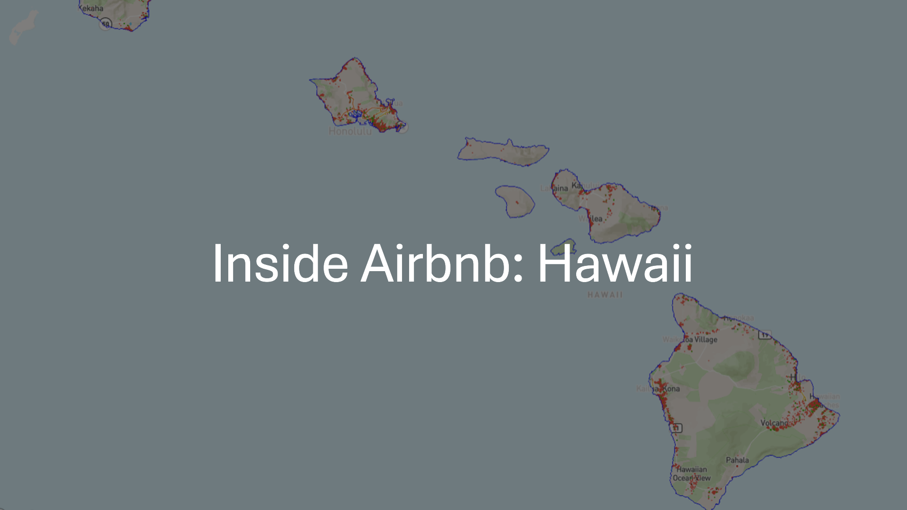

# Inside-Airbnb_Hawaii

 Project to analyze datasets to develop critical analysis skills. Tasks include data requirements identification, data processing, exploratory data analysis, Streamlit app development, Power BI integration and others.

 

## Content

 1. [Datasets](#Datasets)
 2. [Source Code](#Source-Code)
 3. [Guide](#Guide)
 4. [App](#App)
 5. [Images](#Images)

---

## Datasets

- **Row Data** 

  - Includes all original files obtained from [Inside Airbnb](https://insideairbnb.com/get-the-data).

- **New Data**

  - It includes files created after data pre-processing and which will be used for further analysis.

---

## Source Code

- **First Data Review**

  - Overview of all row datasets (entries, columns, type of data, null values, etc).

- **Cleaning Data**

  - Combining datasets, handling null values, creating and deleting columns, etc.

- **Data Analisys**

  - Statistics and application of different tests, such as normality or correlation tests, among others. 

- **Graphs Data Analysis**

  - Creation of graphs for the representation of the distribution of accommodation or average prices, among others. 

---

## Guides

- Streamlit App Connection Guide.
- Streamlit App Navigation Guide.
- Power Bi Panel Navigation.

---

## App

- Multipage App notebooks.

---

## Images

- Include the images used in the app.
